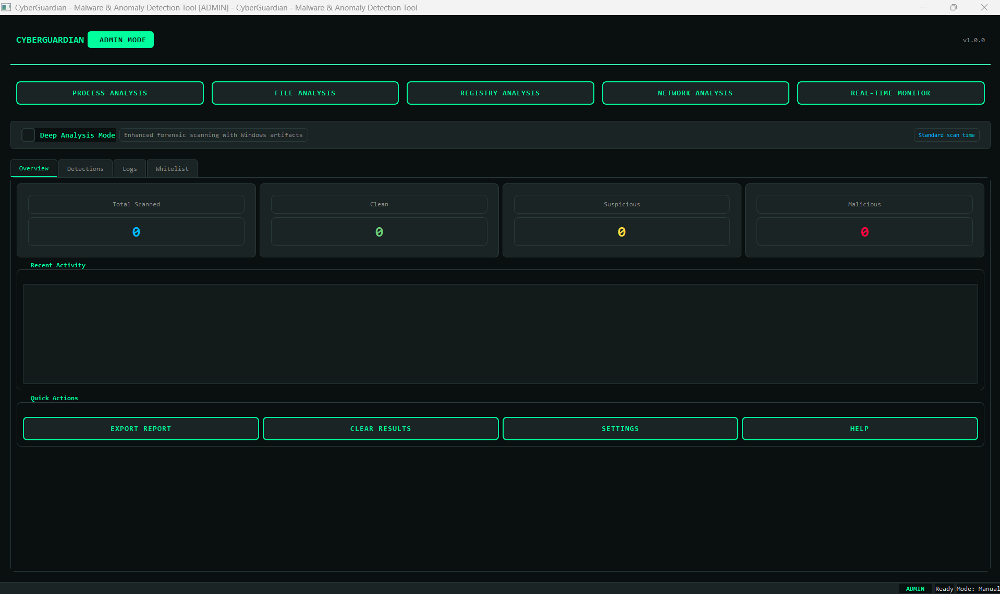
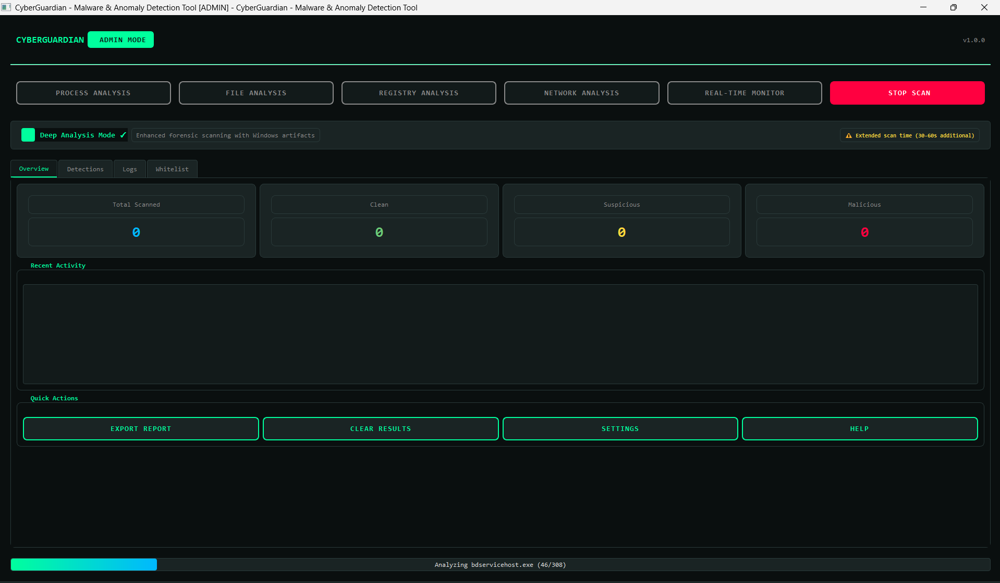
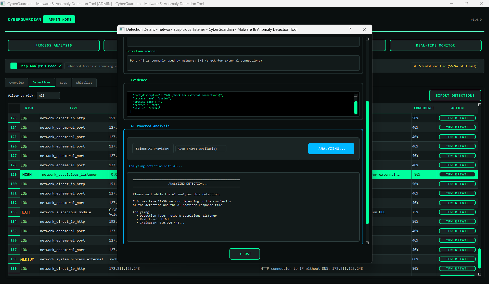
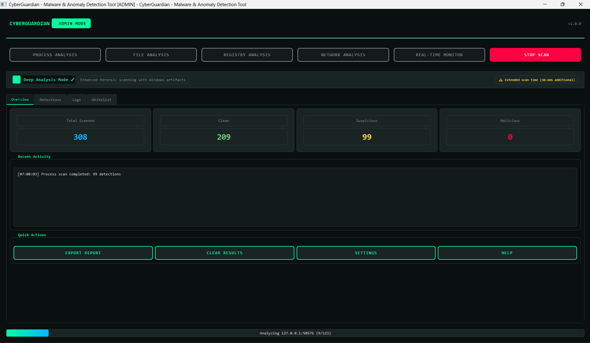

# 🛡️ CyberGuardian

<div align="center">


**Open-Source Malware Detection & Threat Hunting Tool**

[](https://www.python.org/)
[](LICENSE)
[](https://www.microsoft.com/windows)
[](https://github.com/YOUR_USERNAME/CyberGuardian/stargazers)

*A transparent, educational, and highly customizable security tool for everyone*

[Features](#-features) • [Installation](#-installation) • [Usage](#-usage) • [Screenshots](#-screenshots) • [Contributing](#-contributing)

</div>

---

## 📖 About

CyberGuardian is an open-source malware detection and threat hunting tool built entirely in Python. It's designed to be **accessible to everyone** — from everyday computer users who want to verify their downloads to professional threat hunters investigating sophisticated attacks.

### Why CyberGuardian?

Traditional antivirus and EDR solutions are powerful, but they're often **black boxes**. They alert you to threats without explaining WHY something is suspicious, and they don't teach you the methodology behind malware analysis.

CyberGuardian solves this by providing:

- 🔍 **Transparency** — See exactly why every detection was triggered
- 📚 **Education** — Learn threat hunting methodology as you use it
- 🎯 **Simplicity** — Plain-language explanations, not technical jargon
- ⚙️ **Customization** — Modify detection rules, add your own YARA signatures
- 🤖 **AI Integration** — Intelligent analysis powered by multiple LLM providers

---

## 👥 Who Is This For?

| User Type | Use Case |
|-----------|----------|
| **Everyday Users** | Scan downloaded files before opening, check if your computer is compromised, investigate abnormal system behavior |
| **Power Users** | Monitor network connections, check for persistence mechanisms, verify software integrity |
| **Threat Hunters** | Investigate IOCs, hunt for malware persistence, analyze suspicious processes |
| **SOC Analysts** | Triage alerts, perform initial analysis, document findings with AI assistance |
| **Security Researchers** | Analyze malware behavior, test detection rules, study attack techniques |

---

## ✨ Features

### Core Scanning Capabilities

| Scanner | Description |
|---------|-------------|
| 🔹 **Process Analysis** | Detects suspicious processes, memory anomalies, code injection, and process masquerading |
| 🔹 **File Analysis** | YARA rule matching, entropy analysis, PE inspection, hash reputation checking |
| 🔹 **Network Analysis** | Identifies malicious connections, direct IP access, suspicious ports, C2 beacons |
| 🔹 **Registry Analysis** | Finds persistence mechanisms, hijacked associations, malicious services |

### Advanced Features

- 🧠 **AI-Powered Analysis** — Multi-provider LLM integration (DeepSeek, OpenAI, Gemini) with structured threat assessment
- 🌐 **VirusTotal Integration** — Automatic IOC checking against 70+ antivirus engines
- 📊 **Deep Analysis Mode** — Memory forensics, DNS cache inspection, ARP table analysis
- 📋 **MITRE ATT&CK Mapping** — Techniques identified and mapped to the framework
- 📝 **Comprehensive Reporting** — HTML export with full analysis details
- 🔐 **Secure API Storage** — System credential manager integration for API keys

### What's New in v1.1.0

- ✅ **Enhanced AI Response Parsing** — Robust JSON extraction with fallback handling
- ✅ **Improved VirusTotal Integration** — Better IOC detection and malicious IP filtering
- ✅ **Risk Level Adjustment** — Automatic risk elevation based on VT findings
- ✅ **Detailed Debug Logging** — Better troubleshooting for threat hunters
- ✅ **Windows Build Improvements** — pywin32 compatibility, Python version warnings
- ✅ **Automatic Icon Conversion** — PNG to ICO for executable builds

---

## 📁 Project Structure

```
CyberGuardian/
│
├── 📂 main.py                     # Application entry point
├── 📂 requirements.txt            # Python dependencies
├── 📂 build.py                    # PyInstaller build script
├── 📂 setup_windows.bat           # Windows automated setup
│
├── 📂 ui/
│   ├── __init__.py
│   └── main_window.py             # PyQt5 main GUI (3,900+ lines)
│
├── 📂 scanners/
│   ├── __init__.py
│   ├── base_scanner.py            # Abstract scanner base class
│   ├── process_scanner.py         # Process enumeration & analysis
│   ├── file_scanner.py            # File scanning with YARA
│   ├── network_scanner.py         # Network connection analysis
│   ├── registry_scanner.py        # Windows registry scanning
│   ├── memory_analyzer.py         # Memory forensics integration
│   ├── realtime_monitor.py        # Real-time protection monitor
│   └── yara_manager.py            # YARA rule management
│
├── 📂 ai_analysis/
│   ├── __init__.py
│   └── analyzer.py                # Multi-provider AI analysis engine
│
├── 📂 threat_intel/
│   ├── __init__.py
│   ├── intel.py                   # Threat intelligence aggregator
│   └── virustotal_checker.py      # VirusTotal API integration
│
├── 📂 analysis/
│   ├── __init__.py
│   └── deep_analysis_coordinator.py  # Coordinates deep analysis modes
│
├── 📂 reporting/
│   ├── __init__.py
│   └── generator.py               # HTML report generation
│
├── 📂 utils/
│   ├── __init__.py
│   ├── config.py                  # Configuration management
│   ├── logging_utils.py           # Logging setup
│   ├── whitelist.py               # Whitelist management
│   └── secure_storage.py          # Secure API key storage
│
├── 📂 config/
│   └── config.yaml                # Default configuration
│
├── 📂 assets/
│   ├── icon.png                   # Application icon
│   └── icon.ico                   # Windows executable icon
│
├── 📂 data/
│   ├── yara_rules/                # Custom YARA rules directory
│   ├── logs/                      # Application logs
│   └── quarantine/                # Quarantined files
│
├── 📂 docs/
│   └── screenshots/               # Documentation screenshots
│
├── 📄 README.md                   # This file
├── 📄 USER_GUIDE.md               # Detailed user documentation
├── 📄 BUILD_GUIDE.md              # Build instructions
├── 📄 BUILD_FIX.md                # Troubleshooting guide
├── 📄 CONTRIBUTING.md             # Contribution guidelines
└── 📄 LICENSE                     # MIT License
```

---

## 🚀 Installation

### Prerequisites

- **Python 3.9 - 3.12** (Python 3.11 recommended for best compatibility)
- **Windows** (Primary platform, Linux/macOS support planned)

### Quick Start

```bash
# Clone the repository
git clone https://github.com/Souhaieb-Marzouk/CyberGuardian.git
cd CyberGuardian

# Create virtual environment (recommended)
python -m venv venv
venv\Scripts\activate

# Install dependencies
pip install -r requirements.txt

# Run pywin32 post-install (Windows only)
python Scripts\pywin32_postinstall.py -install

# Launch CyberGuardian
python main.py
```

### Automated Setup (Windows)

Run the provided setup script as Administrator:

```cmd
setup_windows.bat
```

### Build Standalone Executable

```bash
# Clean build
python build.py --clean

# Build with distribution package
python build.py --package
```

---

## 🎮 Usage

### Basic Scanning

1. **Launch CyberGuardian** — Run `python main.py` or the compiled executable
2. **Select a Scanner** — Choose from Process, File, Network, or Registry analysis
3. **Configure Options** — Enable Deep Analysis for comprehensive scanning
4. **Start Scan** — Click "Start Scan" and review results
5. **Investigate Detections** — Click "View Details" for full evidence and AI analysis

### AI-Powered Analysis

1. Open any detection detail
2. Select your AI provider (DeepSeek, OpenAI, or Gemini)
3. Click **"ANALYZE WITH AI"**
4. Review the comprehensive analysis including:
   - Verdict (Legitimate/Suspicious/Malicious)
   - Confidence score
   - Technical analysis
   - MITRE ATT&CK techniques
   - Actionable recommendations

### API Configuration

Configure API keys in **Settings → API Keys**:

| API | Purpose | Get Key |
|-----|---------|---------|
| VirusTotal | IOC reputation | [virustotal.com](https://www.virustotal.com/gui/join-us) |
| DeepSeek | AI analysis | [platform.deepseek.com](https://platform.deepseek.com) |
| OpenAI | AI analysis | [platform.openai.com](https://platform.openai.com) |
| Gemini | AI analysis | [makersuite.google.com](https://makersuite.google.com) |

---

## 📸 Screenshots

### Main Dashboard


### Process Analysis


### AI-Powered Detection Analysis


### Network Analysis with Deep Mode


---

## 🔧 Configuration

### YARA Rules

Add custom YARA rules to `data/yara_rules/`:

```
data/
└── yara_rules/
    ├── malware_rules.yar
    ├── custom_detection.yar
    └── ...
```

Rules are automatically loaded on startup.

### Whitelist

Manage whitelisted items in **Settings → Whitelist** or directly edit `data/whitelist.json`.

---

## 🤝 Contributing

Contributions are welcome! Please see [CONTRIBUTING.md](https://github.com/Souhaieb-Marzouk/CyberGuardian/blob/main/CONTRIBUTING.md) for guidelines.

### Ways to Contribute

- 🐛 Report bugs and issues
- 💡 Suggest new features
- 📝 Improve documentation
- 🔧 Submit pull requests
- 🌟 Share the project

---

## 🗺️ Roadmap

### Coming Soon

| Feature | Status | Description |
|---------|--------|-------------|
| Linux/macOS Support | 🔄 Planned | Cross-platform compatibility |
| MITRE ATT&CK Navigator Export | 🔄 Planned | Visual technique mapping |
| One-Click Remediation | 🔄 Planned | Automated threat cleanup |
| Scheduled Scanning | 🔄 Planned | Automated regular scans |
| SIEM Integration | 📋 Planned | Splunk, ELK connectors |
| Case Management | 📋 Planned | Investigation tracking |

---

## ❓ FAQ

### Is CyberGuardian a replacement for antivirus?

**No.** CyberGuardian is designed to complement your existing security tools, not replace them. It provides transparency and educational value that traditional AV/EDR solutions lack.

### Do I need to be a security expert to use this?

**Absolutely not!** CyberGuardian is designed for everyone. Results are explained in plain language, and AI analysis provides clear recommendations.

### Is my data sent to the cloud?

**Only if you choose to.** Core detection happens locally. AI analysis and VirusTotal lookups are optional and require API keys that you control.

### Can I add my own detection rules?

**Yes!** Add YARA rules to `data/yara_rules/` and they'll be automatically loaded.

---

## 📜 License

This project is licensed under the MIT License - see the [LICENSE](https://github.com/Souhaieb-Marzouk/CyberGuardian/blob/main/LICENSE) file for details.

---

## 🙏 Acknowledgments

- [VirusTotal](https://www.virustotal.com) for threat intelligence API
- [YARA](https://virustotal.github.io/yara/) for malware pattern matching
- [DeepSeek](https://deepseek.com), [OpenAI](https://openai.com), and [Google](https://ai.google.dev) for AI capabilities
- The open-source security community

---

## 📞 Contact

- **GitHub**: [Souhaieb-Marzouk/CyberGuardian](https://github.com/Souhaieb-Marzouk/CyberGuardian)
- **LinkedIn**: [Souhaieb Marzouk](https://www.linkedin.com/in/souhaiebmarzouk/)
- **Issues**: [GitHub Issues](https://github.com/Souhaieb-Marzouk/CyberGuardian/issues)

---

<div align="center">

**If you find CyberGuardian useful, please consider giving it a ⭐ star!**

[⬆ Back to Top](#-cyberguardian)

</div>
